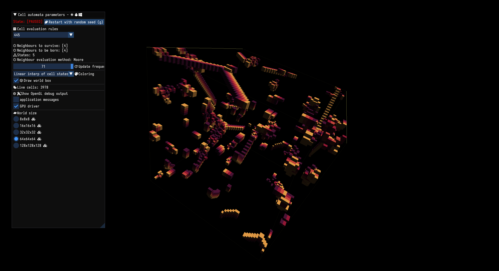
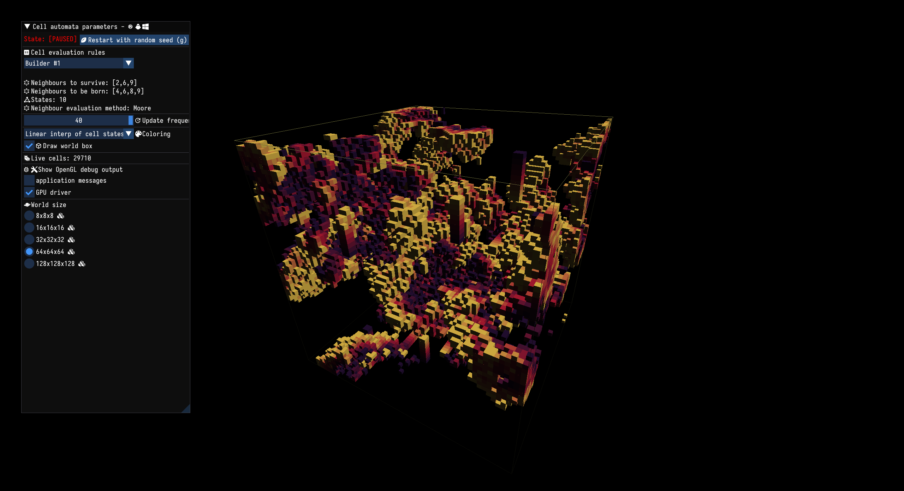
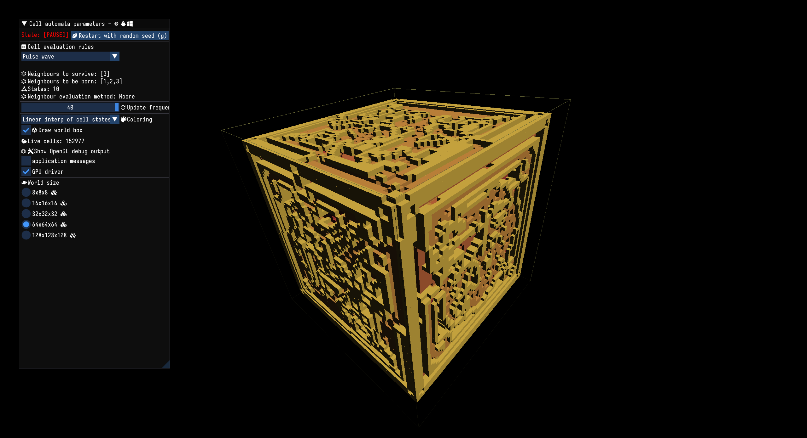
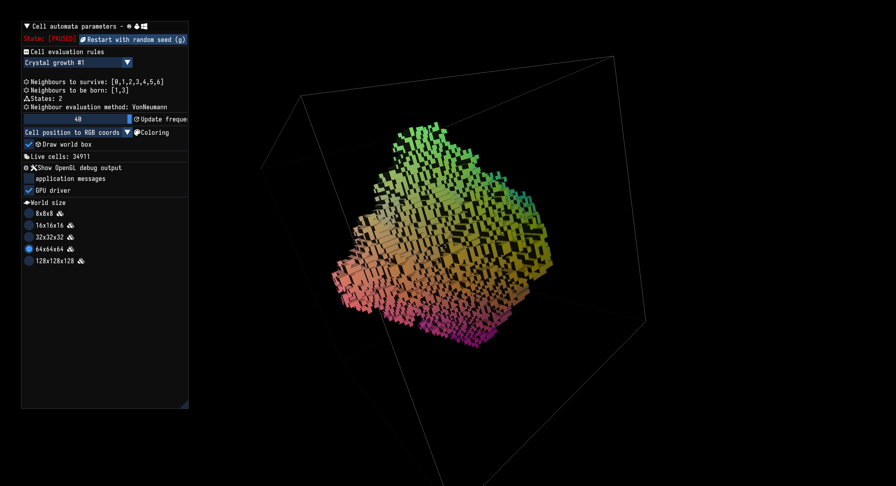
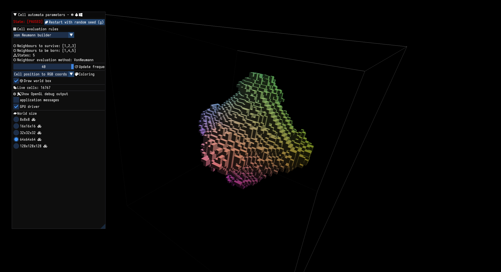

# README #
3D Cellular Automata simulation using Rust and OpenGL.

### References ###

* [Inspired by this blog post](https://softologyblog.wordpress.com/2019/12/28/3d-cellular-automata-3/)
* [2D Cellular automata](https://en.wikipedia.org/wiki/Cellular_automaton)

### How do I get set up? ###

``` sh
cargo run --release
```

### Images ###





